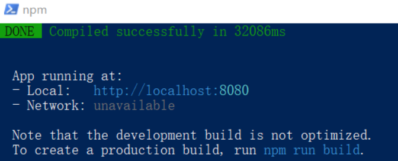
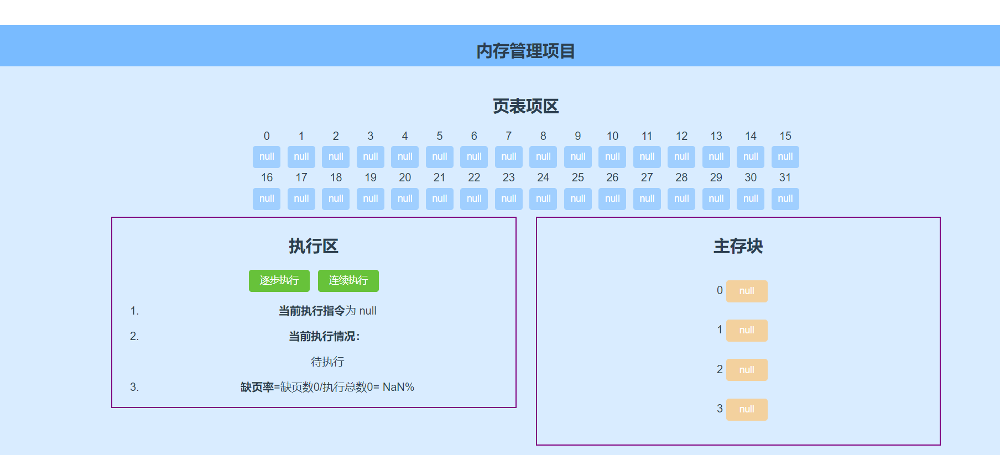

# OS请求调页内存管理项目说明文档

## 一.项目目的

- 掌握操作系统主要的存储管理方式——页式存储管理
- 掌握常见的LRU页面置换算法
- 掌握以vue.js为前端框架的项目开发模式

## 二.项目背景

 **请求调页**是一种动态内存分配技术。它将页面的分配推迟到无法再推迟为止。换言之，一致推迟到进程要访问的页不在**物理内存**为止，从而引发一个**缺页中断**。该技术的引入主要是因为进程开始运行时并不访问地址空间的全部地址，甚至有一部分地址进程永远不会使用。其次，程序的**局部性原理**保证了在程序执行的每个阶段，真正使用的进程页只有一小部分，因此临时不用的物理页面可由其他进程使用。

## 三.项目要求

根据以上背景，建立一个虚拟内存管理环境，实现以下任务：

现有数量为4的内存块即页框分配给某进程。假设每个页面可存放10条指令，该进程（作业）共320条指令，也即其地址空间为32页，初始状态并为有任何页被调入内存。现需要实现页面置换算法，如**LRU算法**和**FIFO算法**来模拟该进程执行过程中**对应内存块的分配状况。**

指令的顺序可由以下方法生成：混合执行。50%的指令顺序执行，25%发指令分布在前地址部分，25%的指令分布在后地址部分。

建立该模拟环境模拟使用混合执行的指令顺序，LRU的页面置换算法虚下的内存分配情况和缺页情况。

## 四.项目入口

### 4.1 开发环境

- vue3.x+Node.js
- vue-cli脚手架+webpack打包

### 4.2 项目入口

1. **在线运行：**

https://onevfall.github.io/OS_memory_management/

2. **本地运行**

本项目依赖于**npm**和 **Vue CLI** ，运行前确保环境中已经配置 **node.js**

请在项目的根目录下打开**Powershell**窗口输入指令：

```javascript
npm install
```

可以下载项目依赖的文件包，接下来再通过：

```js
npm run serve
```

可在本地部署内存调页模拟网页。完成后依照命令窗口的提示可在浏览器中打开。默认在计算机**localhost:8080端口**运行。

出现以下页面，即可成功运行：



## 五. 项目功能

该项目为基于vue框架的前端网页。网页的初始页面如下图所示：




实现了以下的核心功能：

- **实时展示缺页数、缺页率和每条指令的执行情况**

  在页面的执行区实时展示了当前的缺页数和缺页率；在"指令序列"处可查看当前执行的指令与当前指令的执行情况。

- **页框换页情况，指令执行情况的动态展示**

  在页面的中心处展示了需要调度的四个内存块，在指令执行时，内存块会动态展示正在调入的页号。

- **指令执行方式的切换**

  在页面 **执行区** 可以选择不同的执行方式，包括 **逐步执行** 和 **连续执行** 两种指令执行方式。同时，为保证指令执行的完整性，在进行连续执行时，单步执行按钮将被 **禁用** 。而在进行单步执行时，可随时点击 连续执行按钮进行快速执行。

## 六. 项目设计

### 6.1 项目核心置换算法实现

页面置换算法发生在分页管理机制进行虚拟内存分配发生了 **缺页中断时**。发生缺页中断后，需要选择一个页面移出内存，以便为新调入的页面让出空间。用于决定换出哪一页的规则就成为页面置换算法。

本项目实现了**最近最久未使用LRU算法**

> 该算法的依据是 **程序的局部性原理**。 通过一个作业在执行过程中过去的页面访问历史来退出未来的行为。该算法认为在过去一段时间不曾被访问过的页面，在最近的将来也不会被理解访问。程序的局部性原理也说明了在程序下一条执行的位置大概率在上一条指令的附近，也就是说下一个指令的执行位置大概率在刚放文过的页面内而不是很久没有访问过的页面。
>
> 因此，该算法的核心思想是：在发生缺页中断并需要进行页面置换时，总是选择最近一段时间最久为使用的页面予以淘汰。

本项目使用一个LRU链表来进行访问记录的更新，如下：

1. 我们生成一个链表做最近访问的页面的记录，链表头记录的是最新访问的页，链表尾记录的是即将被淘汰（调出）的页面
2. 对于访问的但主存中存在的页面，则将页面对应的主存块调换至链表头
3. 对于访问的但主存中不在的页面，则替换掉链表尾记录的主存块的页面，并把当前访问页所对应的主存块置于链表头

### 6.2 关于指令执行顺序的说明

我们通过init()函数，直接在初始化阶段生成了混合执行的顺序，并记录在数组里，后面我们只需要逐条访问即可。

### 6.3 主存块地址说明

对于此处主存块的地址部分，固定了地址，每个主存块占用10个空间，四个主存块共占用了0-39的地址。

### 6.4 其余函数逻辑介绍

| 函数名       | 功能                                   |
| ------------ | -------------------------------------- |
| next()       | 单步执行一条指令                       |
| autonext()   | 连续执行指令直至指令执行完毕           |
| init()       | 初始化主存块、页表项、指令执行顺序     |
| randomNums() | 生成N长度、大小在[min,max]之间的随机数 |

## 七.项目功能演示与页面说明

**演示方法**：点击逐步执行和连续执行即可开始。若需重置，重新刷新页面即可。

**页面说明**：

1. 页表项区：我们一共有32个页，所以我们展示了32个页表项，分别记录每个页对应的放入的主存块，若当前放入主存块，则我们记录放入的主存块位置；若当前未放入或被调出，则设为**null**
2. 执行区：
   - 设置了两个按钮，逐步执行和连续执行。
   - 显示了当前执行指令
   - 显示了当前执行情况：若不在主存块中，则显示调出页；若在主存块中，则显示其物理地址
   - 显示了当前缺页率（缺页数和执行总数）
3. 主存块区：主存块部分有四个，分别编码0、1、2、3，存储的是放入的页

## 八 .项目总结与反思

**项目亮点：**

- 采用vue.js进行展示，界面美观
- 项目部署成网页，方便展示
- 可以单步执行或连续执行，操作便捷

**项目不足**

- 项目可以进一步实现多种页面置换算法和指令执行顺序，使操作更加便捷自由
- 对于指令的执行情况，仅打印当前，没有打印出以往所有的执行情况，对于学习者没有那么良好的体验


